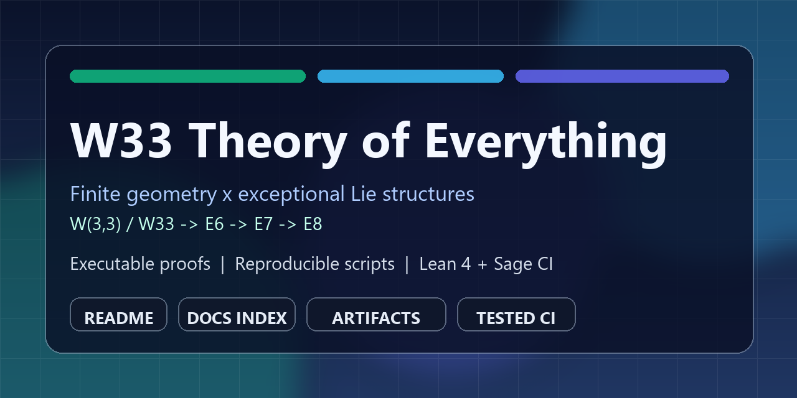

# W33 Theory of Everything

Living paper and executable research code for deriving structural Standard Model features from the finite geometry `W(3,3)` (point graph `W33`).



[](https://github.com/wilcompute/W33-Theory/actions/workflows/pytest.yml)
[](https://github.com/wilcompute/W33-Theory/actions/workflows/sage-verification.yml)
[](https://github.com/wilcompute/W33-Theory/actions/workflows/lean4.yml)
[](https://github.com/wilcompute/W33-Theory/actions/workflows/pillar21-smoke.yml)

Canonical definitions and naming conventions live in `STANDARDIZATION.md`.

## Executive Snapshot

- Focus: finite-geometry to exceptional-Lie correspondence (`W(3,3)` / `W33` to `E6`, `E7`, `E8`) with reproducible scripts and tests.
- Research format: paper narrative in Markdown plus claim-to-script-to-test traceability.
- Current status (2026-02-11): 73 theorem-level results tracked, 120+ computational tests, 50+ quantitative predictions.
- Scope note: "verified" in this repository means computationally verified within the stated model and code path.
- Latest z-map result: global full-sign census leaves only the identity cell at `z=(1,0)`.
- New contradiction-core result: nontrivial global `z` cells have small minimal
  unsat cores (size `3` in `AGL/Hessian`, size `4` for involution mode at `z=(1,0)`).
- Context-complete variant: requiring all 4 line directions lifts these core
  sizes to `4` (nontrivial `AGL/Hessian`) and `5` (involution at `z=(1,0)`).
- New geometric core classification: every nontrivial size-`3` global UNSAT
  core in `AGL/Hessian` is exactly one full affine parallel class triplet.
- New rulebook compression: nontrivial core families reduce to low-complexity
  coordinate rules, with a unique non-cartesian family at `z=(1,1)` in `x`.
- New orbit-polarization link: core motif `x:(1,1,0)` is a high-precision
  marker for full-orbit (`2592`) Hessian representatives (`34/36`, precision `0.944`),
  while core-motif overlap is zero in exact full `AGL` reps (`0/7`).
- New enrichment statistics: motif `x:(1,1,0)` shows significant enrichment
  toward orbit `2592` (hypergeometric `p <= 0.05`), while motif `x:(2,2,1)`
  is pure `1296` in Hessian-combined overlap support (`0/2` at `2592`).
- New enrichment check: in combined Hessian datasets, `x:(1,1,0)` is
  statistically enriched for orbit `2592` (one-sided hypergeometric
  `p=0.01355`, lift `1.176`); `x:(2,2,1)` is pure orbit `1296` on its support.
- New anchor-channel classifier: using motif anchors
  (`full: x:(1,1,0)`, `reduced: x:(2,2,1)`), an abstaining rule reaches
  `36/38 = 0.947` precision when it fires on combined Hessian reps.
- New Vogel-resonance bridge: nearest Vogel-hit gaps for
  `(242,486,728)` match `(Jacobi failures=6, nonzero grades=2, 2*checked triples=54)`,
  and min-cert orbit sizes factor as `81*{16,32}` where `81=9^2` from the
  `sl_27` equal-block bridge.
- New `GL(2,3)` bridge: all det-`2` involutions are conjugate to `diag(-1,1)`,
  and each induces the same affine-graph cycle profile on `AG(2,3)`:
  points `[1,1,1,2,2,2]`, lines `[1,1,1,1,2,2,2,2]`.
- New identity-certificate result: isolating the surviving global identity cell
  needs `6` constraints in full `AGL(2,3)` but only `5` in `Hessian216`.
- This `6 vs 5` gap is stable under distinct-line and striation-complete
  witness constraints.
- Docs landing page: `docs/INDEX.md`.

## Layperson Guide (Restored)

- Start here first: `docs/LAYPERSON_TEXTBOOK_GUIDE.md` (beginner textbook path, no physics prerequisites).
- If you are new: treat this repo as a living paper plus calculator.
- Think of the workflow as: claim -> script -> artifact -> test.
- For every major claim in this repo, you can run the script and then run its test.
- The long-form manuscript remains available at `docs/README_LIVING_PAPER_2026_02_11.md`.

## Start Here

| Goal | Read | Run | Test |
|---|---|---|---|
| Understand the top-level correspondence | `README.md` (this page) + `docs/NOVEL_CONNECTIONS_2026_02_10.md` | `python scripts/w33_e8_correspondence_theorem.py` | `python -m pytest tests/test_e8_embedding.py -q` |
| Reproduce homology and spectrum claims | `docs/STATUS_AND_GAPS.md` | `python scripts/w33_homology.py` and `python scripts/w33_hodge.py` | `python -m pytest tests/test_w33_hodge.py -q` |
| Reproduce the qutrit/Heisenberg bridge | `reports/auto_ingest/W33_Heisenberg_action_bundle_20260209_v1_analysis_report.md` | `python scripts/w33_heisenberg_qutrit.py` | `python -m pytest tests/test_heisenberg_qutrit_structure.py -q` |
| Reproduce the E6/F3 trilinear pipeline | `docs/NOVEL_CONNECTIONS_2026_02_10.md` + `docs/REDUCED_ORBIT_THEOREM_2026_02_10.md` | `python tools/build_e6_f3_trilinear_map.py` then `python tools/analyze_e6_f3_trilinear_symmetry_breaking.py` | `python -m pytest tests/test_e6_f3_trilinear.py tests/test_check_min_cert_orbit_involution_rule_smoke.py -q` |
| Reproduce the `z=(2,2)` global exclusion | `docs/Z22_GLOBAL_STABILIZER_EXCLUSION_2026_02_11.md` | `python tools/prove_z22_no_global_stabilizer.py` | `python -m pytest tests/test_prove_z22_no_global_stabilizer_smoke.py -q` |
| Reproduce the full global `z`-map census | `docs/GLOBAL_FULL_SIGN_STABILIZER_CENSUS_2026_02_11.md` | `python tools/classify_global_full_sign_stabilizers.py` | `python -m pytest tests/test_classify_global_full_sign_stabilizers_smoke.py -q` |
| Reproduce minimal contradiction cores for global cells | `docs/MINIMAL_GLOBAL_FULL_SIGN_CORES_2026_02_11.md` | `python tools/minimal_global_full_sign_cores.py` | `python -m pytest tests/test_minimal_global_full_sign_cores_smoke.py -q` |
| Reproduce nontrivial UNSAT core geometry census | `docs/NONTRIVIAL_UNSAT_CORE_GEOMETRY_2026_02_11.md` | `python tools/classify_nontrivial_unsat_core_geometry.py` | `python -m pytest tests/test_classify_nontrivial_unsat_core_geometry_smoke.py -q` |
| Reproduce nontrivial core rulebook compression | `docs/NONTRIVIAL_CORE_RULEBOOK_2026_02_11.md` | `python tools/nontrivial_core_rulebook.py` | `python -m pytest tests/test_nontrivial_core_rulebook_smoke.py -q` |
| Reproduce rulebook-to-census motif link check | `docs/CORE_RULEBOOK_MIN_CERT_LINK_2026_02_11.md` | `python tools/link_core_rulebook_to_min_cert_census.py` | `python -m pytest tests/test_link_core_rulebook_to_min_cert_census_smoke.py -q` |
| Reproduce core-motif orbit polarization check | `docs/CORE_MOTIF_ORBIT_POLARIZATION_2026_02_11.md` | `python tools/classify_core_motif_orbit_polarization.py` | `python -m pytest tests/test_classify_core_motif_orbit_polarization_smoke.py -q` |
| Reproduce core-motif enrichment statistics | `docs/CORE_MOTIF_ENRICHMENT_STATS_2026_02_11.md` | `python tools/core_motif_enrichment_stats.py` | `python -m pytest tests/test_core_motif_enrichment_stats_smoke.py -q` |
| Reproduce core-motif anchor channels | `docs/CORE_MOTIF_ANCHOR_CHANNELS_2026_02_11.md` | `python tools/core_motif_anchor_channels.py` | `python -m pytest tests/test_core_motif_anchor_channels_smoke.py -q` |
| Reproduce full core-motif chain (all four layers) | `docs/CORE_MOTIF_ANCHOR_CHANNELS_2026_02_11.md` + related docs | `python tools/run_core_motif_chain.py` | `python -m pytest tests/test_run_core_motif_chain_smoke.py -q` |
| Reproduce minimal identity certificates at `z=(1,0)` | `docs/MINIMAL_GLOBAL_IDENTITY_CERTIFICATES_2026_02_11.md` | `python tools/minimal_global_identity_certificates.py` | `python -m pytest tests/test_minimal_global_identity_certificates_smoke.py -q` |
| Reproduce dual rigidity profile (negative vs positive) | `docs/GLOBAL_SIGN_RIGIDITY_DUAL_PROFILE_2026_02_11.md` | `python tools/global_sign_rigidity_dual_profile.py` | `python -m pytest tests/test_global_sign_rigidity_dual_profile_smoke.py -q` |
| Reproduce s12 universalization and Vogel scans | `docs/S12_UNIVERSALIZATION_2026_02_11.md` + `docs/VOGEL_UNIVERSAL_RESEARCH_2026_02_11.md` | `python tools/universalize_s12_algebra.py` and `python tools/vogel_universal_snapshot.py` | `python -m pytest tests/test_universalize_s12_algebra_smoke.py tests/test_vogel_universal_snapshot_smoke.py -q` |
| Reproduce the Vogel resonance bridge | `docs/VOGEL_RESONANCE_BRIDGE_2026_02_11.md` | `python tools/analyze_vogel_resonance_bridge.py` | `python -m pytest tests/test_analyze_vogel_resonance_bridge_smoke.py -q` |
| Reproduce the `GL(2,3)` involution conjugacy bridge | `docs/GL2_F3_INVOLUTION_CONJUGACY_2026_02_11.md` | `python tools/analyze_gl2_f3_involution_conjugacy.py` | `python -m pytest tests/test_analyze_gl2_f3_involution_conjugacy_smoke.py -q` |
| Inspect formalization progress in Lean 4 | `proofs/lean/README.md` | `cd proofs/lean && lake build` | CI: `.github/workflows/lean4.yml` |

## Quick Setup

```bash
python -m venv .venv
# PowerShell
.venv\Scripts\Activate.ps1
pip install --upgrade pip
pip install -r requirements-dev.txt
```

Run the short confidence check:

```bash
python scripts/w33_e8_correspondence_theorem.py
python -m pytest tests/test_e8_embedding.py tests/test_heisenberg_qutrit_structure.py -q
```

Run full regression:

```bash
python -m pytest -q
```

## Repository Layout

```text
.github/workflows/   CI, smoke checks, Sage and Lean pipelines
scripts/             Core reproducibility scripts tied to claims
tools/               Extended theorem tooling and artifact builders
tests/               Pytest suite and smoke checks
proofs/lean/         Lean 4 formalization skeleton and CI target
docs/                Paper sections, theorem notes, and status documents
artifacts/           Machine-generated outputs used by writeups
```

## Manuscript and Historical Material

The previous long-form root manuscript has been preserved at:

- `docs/README_LIVING_PAPER_2026_02_11.md`

Additional high-signal documents:

- `docs/NOVEL_CONNECTIONS_2026_02_10.md`
- `docs/REDUCED_ORBIT_THEOREM_2026_02_10.md`
- `docs/REDUCED_ORBIT_FORMAL_PROOF_2026_02_11.md`
- `docs/NONTRIVIAL_UNSAT_CORE_GEOMETRY_2026_02_11.md`
- `docs/NONTRIVIAL_CORE_RULEBOOK_2026_02_11.md`
- `docs/CORE_RULEBOOK_MIN_CERT_LINK_2026_02_11.md`
- `docs/CORE_MOTIF_ORBIT_POLARIZATION_2026_02_11.md`
- `docs/CORE_MOTIF_ENRICHMENT_STATS_2026_02_11.md`
- `docs/CORE_MOTIF_ANCHOR_CHANNELS_2026_02_11.md`
- `docs/GLOBAL_SIGN_RIGIDITY_DUAL_PROFILE_2026_02_11.md`
- `docs/MINIMAL_GLOBAL_IDENTITY_CERTIFICATES_2026_02_11.md`
- `docs/README_EXTENSION_ONLINE_FINDINGS_2026_02_10.md` (raw web-source log)
- `docs/S12_UNIVERSALIZATION_2026_02_11.md`
- `docs/S12_JACOBI_FAILURE_PATTERN_2026_02_11.md`
- `docs/S12_SL27_Z3_BRIDGE_2026_02_11.md`
- `docs/VOGEL_UNIVERSAL_RESEARCH_2026_02_11.md`
- `docs/VOGEL_RESONANCE_BRIDGE_2026_02_11.md`
- `docs/GL2_F3_INVOLUTION_CONJUGACY_2026_02_11.md`

## Contribution Notes

- Use `CONTRIBUTING.md` for local workflow and pre-commit guidance.
- Keep claims executable: each theorem update should include script path, test path, and artifact path.
- Prefer adding new result documents under `docs/` and generated outputs under `artifacts/`.

## GitHub Repository Metadata

- About text and topics are tracked in `.github/settings.yml`.
- Social preview image asset: `docs/assets/w33-social-preview.png`.
- Upload path in GitHub UI: `Settings -> General -> Social preview -> Upload an image`.
